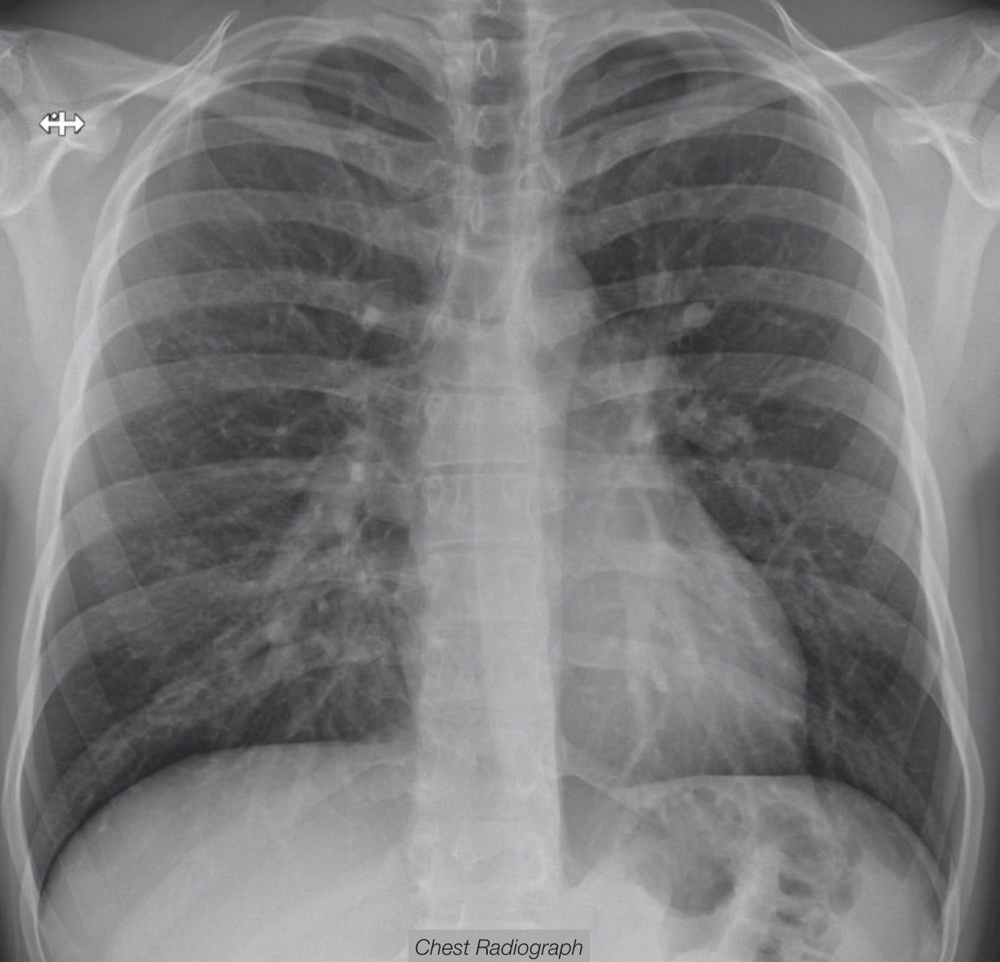
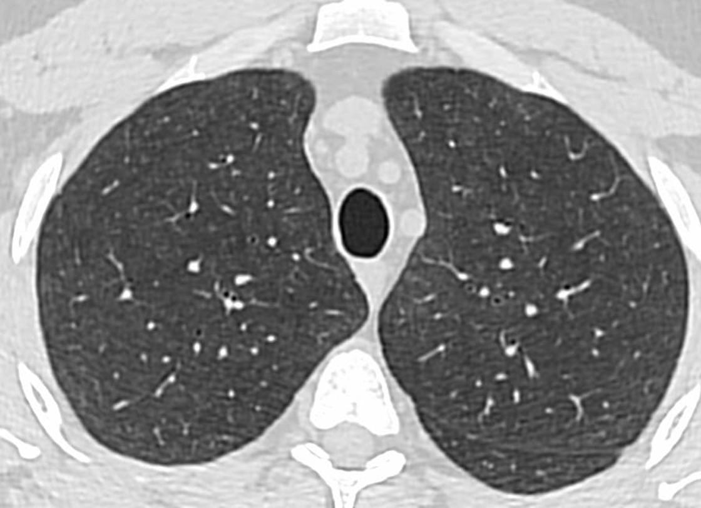
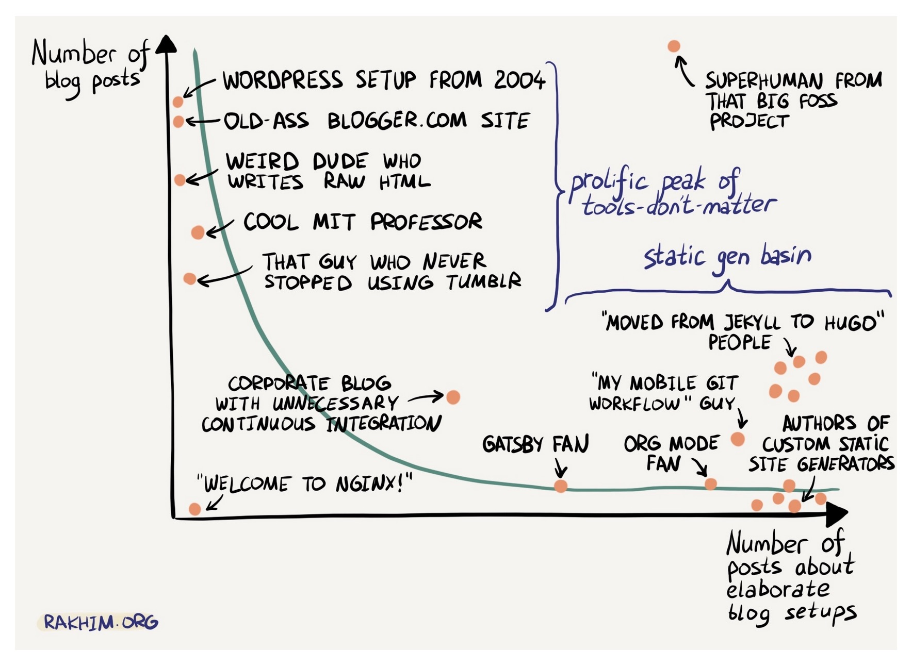
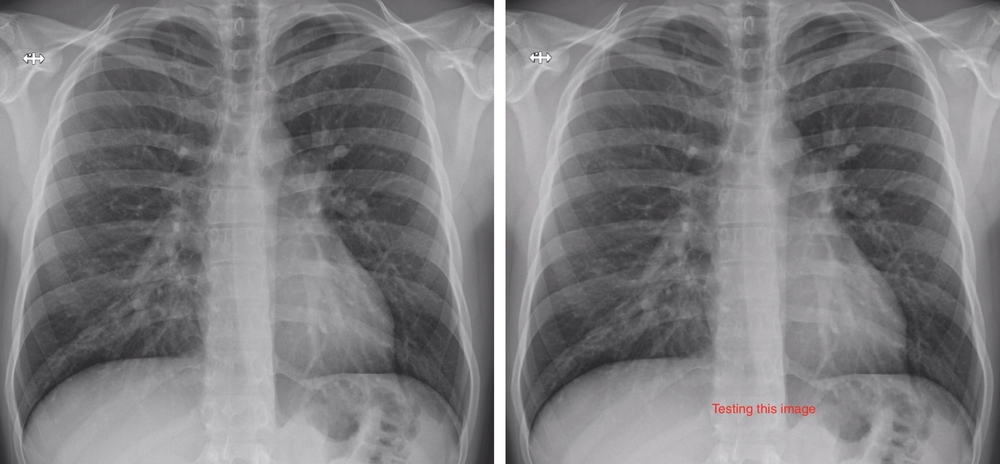
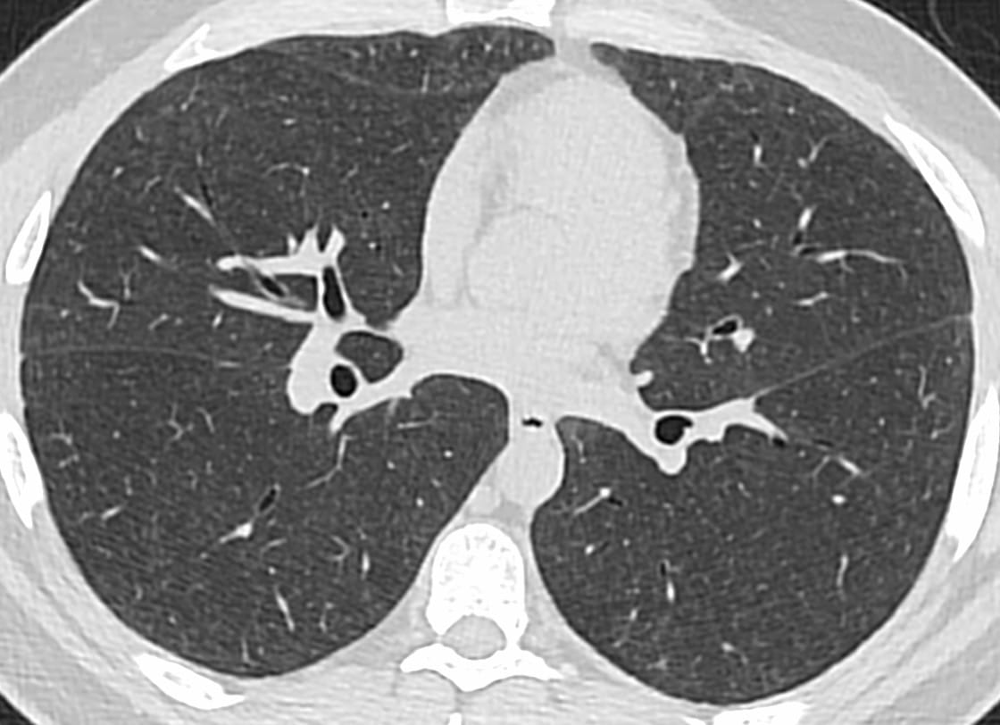
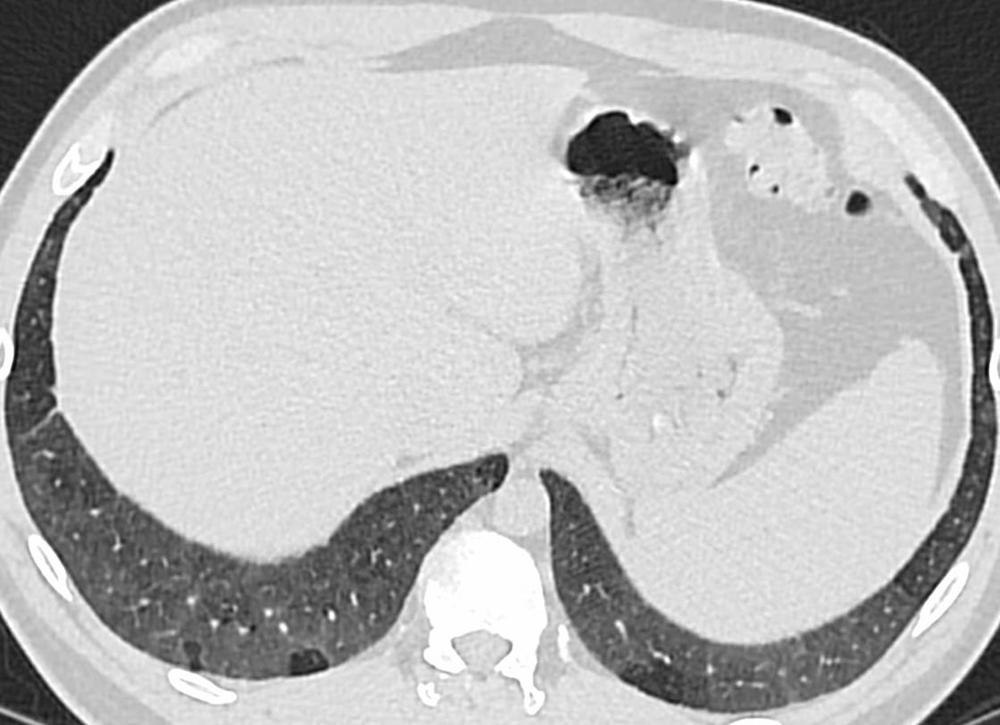

<!-- setup and libraries chunk -->


```{r setup, include=FALSE}
knitr::opts_chunk$set(echo = FALSE)
library(kableExtra)
library(xaringanExtra)
```

Distill is a publication format for scientific and technical writing, native to the web. Learn more about using Distill for R Markdown at <https://rstudio.github.io/distill>. Much more text here ad libitem, etc, etc.


More text here... And then a link to [chestradiologists.org](http:chestradiologists.org).

The <span style="color:blue">**blue border**</span> around the image indicates it's lightboxed.


<aside>
How many characters can I write here before it wraps to a new line ? Maybe need more characters before wrapping.
</aside>  

<aside>
<div class="lightbox"> 
{width=200 style="border: 2px solid rgba(1,169,219);"}
</div>
</aside>

Testing a right-floated image with wraparound text:

::: {.floatting}


Vivamus venenatis egestas eros ut tempus. Vivamus id est nisi. Aliquam molestie erat et sollicitudin venenatis. In ac lacus at velit scelerisque mattis.

```{r out.width='30%', out.extra='style="float:right; padding:10px"'}

```

Vivamus venenatis egestas eros ut tempus. Vivamus id est nisi. Aliquam molestie erat et sollicitudin venenatis. In ac lacus at velit scelerisque mattis.

Vivamus venenatis egestas eros ut tempus. Vivamus id est nisi. Aliquam molestie erat et sollicitudin venenatis. In ac lacus at velit scelerisque mattis.

Vivamus venenatis egestas eros ut tempus. Vivamus id est nisi. Aliquam molestie erat et sollicitudin venenatis. In ac lacus at velit scelerisque mattis.
:::

<div class="boxBorder">
Testing a bordered Box
</div>

<br>


Testing inclusion of an outside web image, with attribution, but no lightbox function.

```{r echo=FALSE, fig.cap="Figure from https://timogrossenbacher.ch/2016/12/beautiful-thematic-maps-with-ggplot2-only/", out.extra="class=external"}
knitr::include_graphics("https://timogrossenbacher.ch/wp-content/uploads/2016/12/tm-final-map-1-1.png")
```

And another simpler way to do this for an external file with attribution:

{width=300px .center .external}


```{r}
text_tbl <- data.frame(
  Items = c("Item 1", "Item 2", "Item 3"),
  Features = c(
    "Lorem ipsum dolor sit amet, consectetur adipiscing elit. Proin vehicula tempor ex. Morbi malesuada sagittis turpis, at venenatis nisl luctus a. ",
    "In eu urna at magna luctus rhoncus quis in nisl. Fusce in velit varius, posuere risus et, cursus augue. Duis eleifend aliquam ante, a aliquet ex tincidunt in. ", 
    "Vivamus venenatis egestas eros ut tempus. Vivamus id est nisi. Aliquam molestie erat et sollicitudin venenatis. In ac lacus at velit scelerisque mattis. "
  )
)

kable(text_tbl, format = "html") %>%
  kable_styling(full_width = F) %>%
  column_spec(1, bold = T, border_right = T) %>%
  column_spec(2, width = "50em")
```


### Definition lists

This is an example of creating a section of *definitions* with different formating:

Aggregation

:   **The process of collecting or gathering many separate pieces into a whole.**

Analytical skills *in programming*

:   Qualities and characteristics as well as computational tools associated with using facts to solve problems. E.g.,


```
R markdown, R packages, etc.

```

        
Area chart

:   A data visualization that uses individual data points for a changing variable connected by a continuous line with a field in area underneath.

### Testing two column grid

This is a css-derived alternative to a floating image for displaying an image with adjacent text. 

<div class="wrapper2">
<div>
{width=90%}
</div>
<div>
Text here associated with the image alongside. <span style="color:green">&xrarr;</span>

Suitable for explication text using colored arrows <span style="color:blue">&xrarr;</span>

Vivamus venenatis egestas eros ut tempus. Vivamus id est nisi. Aliquam molestie erat et sollicitudin venenatis. In ac lacus at velit scelerisque mattis <span style="color:red">&xrarr;</span>


</div>
</div>

</br>


Inserting a horizontal line before and after a Teaching Points box.

<div><hr></div>


<div class = "blue">
**Teaching Points**

- This is my first teaching point
- This is my second teaching point

</div>

<div><hr></div>

<p></p>

An example of a small table.


```{r}
my_tbl <- tibble::tribble(
   ~`A header here`, ~`A header for this`,
        "testing this",     "testing this too",
        "confirm text",      "more text"
)

kable(my_tbl, row.names =FALSE, format ="html") %>%
                 kable_styling(bootstrap_options = "striped")
``` 


## Chest Radiography

<div class="lightbox">
```{r out.width='60%', fig.align='center'}

```
</div>

Here's some text to see a hoverable footnote ^[An interesting aside here] of some kind.


Testing another kind of sidenote here. It contains a link to an article at **pubmed.gov**.

<aside>
[This is a link](https://www.ncbi.nlm.nih.gov/pubmed/1871263) to a review article on lung edema.
</aside>

## Radiography of Lung Edema

### Chest Radiography


Here are several illustrative cases. 

<aside>
Click on the arrowhead to reveal and click again to close the case
</aside>

<details><summary>Hydrostatic Lung Edema</summary>

  
These are the pertinent findings:

<div class="lightbox">

```{r fig.align='center', out.width='60%'}

```
</div>
  
This case is interesting for the following reasons:

* one reason
* second reason

<p id="closecase">
    <span>End of Case</span>
</p>

</details>

<details><summary>Acute Lung  Injury Edema</summary>
  
Another image here.
  
</details>

<br>

Testing inline code:

Here is `inline code` for a declaration.

Blockquoting

> Here is a quote from me 
>
> — Howard Mann

<div><hr></div>


#### An approach to lung edema


::: l-page
|                         | Cardiac (hydrostatic) edema | Hypervolemic (hydrostatic) edema | Acute lung injury edema |
|:--|:---:|:---:|:---:|
| Blood flow distribution |   Inversion<sup>1<sup>   |      Balanced      |          Normal         |
| Interstitial edema      |      Yes      |         Yes        |      No or minimal      |
:::


<span style="font-size:80%">1. If *chronic* pulmonary venous hypertension is present</span>

### Testing Pacsbin viewer

Here is text before presentation of the embedded viewer.  


<p>

<div style="text-align:center;">
  <iframe class="pacsbin"
         id="vali"
         src="https://www.pacsbin.com/c/W1QLNa-iQS?s=5db79e00e55657647bcf5e1f&i=5db79e00e55657647bcf5e20&ww=3601&wc=2560&an=false&overlay=false&notes=false&header=false"
         style="width: 500px; height: 500px; border: 0;"></iframe>
         <ul class="list-inline list-pipe">
         <li><a class="pacsbin-link" href="#vali?s=0">PA Chest</a></li>
         <li><a class="pacsbin-link" href="#vali?s=1&scale=0.75">Axial CT</a></li>
         </ul>
</div>
          
</p>

Let's try a panelset with four Tabs:

<aside>
Return to the *Presentation Tab* when you're finished with the case
</aside>

```{r panelset, echo=FALSE}
xaringanExtra::use_panelset()
```

::::: {.panelset}

::: {.panel}

## Clinical Presentation {.panel-name}

This will be the History and Clinical Presentation.

:::

::: {.panel}

## Images {.panel-name}

````{=html}
<div style="text-align:center;">
<iframe src="https://player.vimeo.com/video/510041214" style="width: 480px; height: 512px; border: 0;" allowfullscreen></iframe>
</div>
````

:::

::: {.panel}

## Explanation of Findings {.panel-name}

This will be the explanation of the findings and an explication.

Testing Pacsbin again...

```{=html}
<p>

  <div style="text-align:center;">
  <iframe class="pacsbin"
         id="vali1"
         src="https://www.pacsbin.com/c/W1QLNa-iQS?s=5db79e00e55657647bcf5e1f&i=5db79e00e55657647bcf5e20&ww=3601&wc=2560&an=false&overlay=false&notes=false&header=false"
         style="width: 600px; height: 600px; border: 0;"></iframe>
         <ul class="list-inline list-pipe">
         <li><a class="pacsbin-link" href="#vali1?s=0">PA Chest</a></li>
         <li><a class="pacsbin-link" href="#vali1?s=1&scale=0.75">Axial CT</a></li>
         </ul>
         
  </div>
          
</p>
```

:::

::: {.panel}

## Explanation II Three Columns {.panel-name}

<div class="wrapper3">
<div>
{width=95%}
</div>
<div>
{width=95%}
</div>

<div>

<span style="font-size:90%">
Text here associated with the image alongside. <span style="color:green">&xrarr;</span>
</span>

<span style="font-size:90%">
Suitable for explication text using colored arrows <span style="color:blue">&xrarr;</span>
</span>

</div>
</div>


:::

:::::

O.K. 

Sweet!  It works!! 

<br>

<div class="lightbox">

```{r fig.align='center', out.width= "600px"}

```
</div>

Two CXR images side-by-side (without lightbox function). 

{width=49%} {width=49%}

Three CXR images side-by-side (without lightbox function; must have same pixel dimensions). 

{width=32%} {width=32%} {width=32%}

<script type="text/javascript" src="pacsbin-client.js"></script>
<script type="text/javascript" src="newpacsbin-client.js"></script>
<script type="text/javascript" src="lightbox.js"></script>


